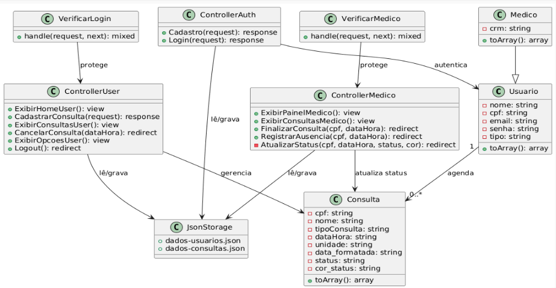

# PROJETO: SISTEMA DE AGENDAMENTO DE CONSULTAS MÉDICAS
## Objetivo do projeto:
Criação de um sistema que possibilita o agendamento em casa de um paciente para a Unidade Básica de Saúde ou Unidade Hospitalar mais próxima. Tendo como principal segmento para a eficácia a facilidade e a rapidez da possibilidade de agendamento sem necessitar de ir a unidade de saúde.
## Como ele irá funcionar na prática:
O projeto possibilitará ao usuário e possivelmente ao profissional dá saúde ter acesso a uma sequencia de funções desse sistema (conhecido como CRUD). Sendo para a aba de usuário viabilizando no pedido de um agendamento, visualização e o cancelamento do agendamento. Já para o profissional da saúde a possibilidade de gerir, definir estados do agendamento - podendo ser um dos exemplos de estado: a falta da presença do paciente.
O sistema deverá oferecer uma interface simples, amigável e acessível - já que projeto irá ter como alvo os públicos tanto jovens adultos quanto idosos. Afim de entregar uma experiencia transparente e objetiva para o usuário final.

## Diagrama UML:


## Estrutura do Projeto

```
agendamento-sigf-laravel/
├── app/
│   ├── Http/
│   │   ├── Controllers/
│   │   │   ├── ControllerAuth.php
│   │   │   ├── ControllerUser.php
│   │   │   └── ControllerMedico.php
│   │   └── Middleware/
│   │       ├── VerificarLogin.php
│   │       └── VerificarMedico.php
│   └── Models/
│       ├── ModeloUsuario.php
│       ├── ModeloMedico.php ← extends ModeloUsuario
│       └── ModeloConsulta.php
├── bootstrap/
│   └── app.php
├── public/
│   └── style.css
├── resources/
│   └── views/
│       ├── layout/
│       │   └── app.blade.php
│       ├── home.blade.php
│       ├── cadastro.blade.php
│       ├── login.blade.php
│       ├── painel.blade.php
│       ├── agendamento.blade.php
│       ├── consultas.blade.php
│       ├── opcao.blade.php
│       ├── painel_medico.blade.php
│       └── consultas_medico.blade.php
├── routes/
│   └── web.php
└── storage/
    └── app/
        ├── dados-usuarios.json
        └── dados-consultas.json
```

## Principais Funcionalidades

**1. Usuário (Paciente)**
* Criar agendamento
* Visualizar consultas marcadas
* Cancelar agendamento

**2. Profissional de Saúde (Médico)**
* Visualizar todos os agendamentos do sistema
* Marcar consulta como finalizada
* Registrar ausência de paciente

## Regras de Negócio
* Um paciente pode ter vários agendamentos.
* Cada agendamento pertence a apenas um paciente.
* Médicos não podem ser cadastrados pela aplicação — o cadastro é feito diretamente no arquivo de dados.
* O status do agendamento pode ser:
    * Agendado
    * Finalizado
    * Ausente
    * Cancelado

## Tecnologias Utilizadas

**1. Frontend:**
* HTML5
* CSS3
* JavaScript (Vanilla)
* Blade (Laravel Template Engine)

**2. Backend:**
* PHP com Laravel

**3. Armazenamento de Dados:**
* Arquivos JSON (sem banco de dados relacional)

## Nota do Criador
Esse projeto foi feito e inspirado na temática de um projeto do semestre passado, coordenado pelo professor Marcelo em 2025. Gostei muito de desenvolvê-lo — transformar uma ideia que existia apenas no papel em algo funcional foi desafiador, porém ao concluí-lo me sinto vitorioso.


## Licença
Projeto desenvolvido por loPs001, apenas para fins educacionais.
Obrigado pela atenção!


